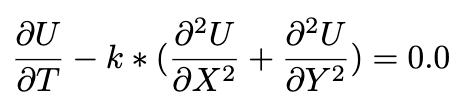

# 1. Write a C program to solve a two-dimensional heat equation of the form shown below

The following conditions are to be observed:

1. The input array (representing U) will be any black and white or colored image that you obtain on your own. For example, https://www.researchgate.net/figure/8-bit-256-x-256-Grayscale-Lena-Image_fig1_3935609
2. The image should preferably have sharp edges.
3. Read the image into an array U and use the two dimensional heat equation to change the state of U in time (time evolution).
4. Please choose boundary conditions by yourself. Note that boundary conditions don’t have to change with time. One possible boundary condition is to keep all the boundaries to either white or black.
5. Perform the time evolution (or time integration) for a number of time steps and plot the image at the first time step and at the last time step, and at one or more intermediate time step(s).
6. For reference, look at the image animation shown here https://gpuopen.com/learn/amd-lab-notes/amd-lab-notes-finite-difference-docs-laplacian_part1/#laplacian Please try not to read the whole description on this page. It may confuse you.

# Prerequisites 

### wine_example.c

You have a bucket of wine and every evening you drink one litre, then you add a litre of water.  
Calculate the wine concentration after 10 days.  
(0 Dimension + Time)  

### steel_beam_example.c

You have a steel beam with two heat sources at each end. The first is 75° and the other 50°.  
(1 Dimension + Time)  
